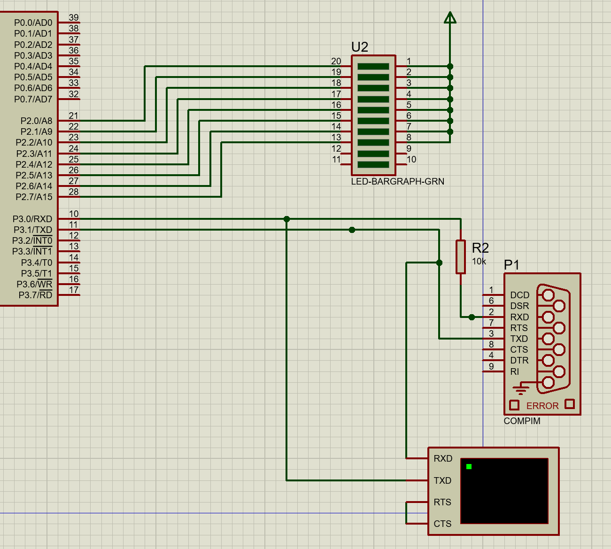
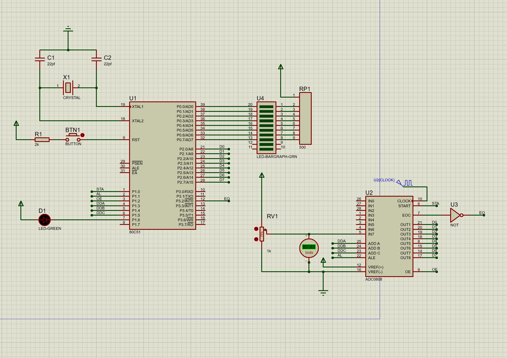

# 收集

两个双字节数字相加。

```asm
//data
XH DATA 40H
XL DATA 41H
YH DATA 50H
YL DATA 51H

ORG 0000H
LJMP MAIN

ORG 0030H
MAIN:
	MOV XH,#11H
	MOV XL,#22H
	MOV YH,#33H
	MOV YL,#44H
	MOV A,XL
	CLR C
	ADD A,YL
	
	MOV XL,A
	MOV A,XH
	ADDC A,YH
	
	MOV XH,A
	LJMP $
END
```


中断问题

```c
#include <reg51.h>
typedef unsigned char uchar;
uchar CONT = 0;
void init(){
	EA = 1;
	EX0 = 1;
	IT0 = 1;
}
void main(void){
	init();
	while(1);
}

void EX0_INT() interrupt 0{
	++CONT;
	P2 = ~CONT;
}
```


计数器

```c
#include <reg51.h>
typedef unsigned char uchar;
typedef unsigned long uint;

sbit OUT_PIN = P1 ^ 0;
uint CONT = 0;
uchar SUM = 0;
void init(){
	TH0 = 0xff - 1;
	TL0 = 0xff - 1;
	TMOD = 0x06;
	EA = 1;
	ET0 = 1;
	TR0 = 1;
}
void main(void){
	OUT_PIN =1;
	init();
	while(1);
}

void T0_INT() interrupt 1{
	if(++CONT == 1){
		OUT_PIN = ~OUT_PIN;
		CONT = 0;
	}
	P2 = SUM;
	SUM++;
}
```

计时器

```c
#include <reg51.h>
typedef unsigned char uchar;
typedef unsigned int uint;
sbit OUT_PIN = P1 ^ 0;
uint CONT = 0;
void init(){
	TH0 = 0xff - 1;
	TL0 = 0xff - 1;
	TMOD = 0x02;
	EA = 1;
	ET0 = 1;
	TR0 = 1;
}
void main(void){
	OUT_PIN =1;
	init();
	while(1);
}

void T0_INT() interrupt 1{
	if(++CONT == 200){
		OUT_PIN = ~OUT_PIN;
	}
}
```


串行通信

```c
#include <reg51.h>

typedef unsigned char uchar;
typedef unsigned int uint;
typedef unsigned long ulong;

#define LEDS P2
sbit LED = P1 ^ 0;
uchar CONT = 0;
void init(){
	TMOD = 0x20;
	TH1 = 0xfd;
	TL1 = 0xfd;
	SCON = 0x50;
	
	EA = 1;
	TR1 = 1;
	ES = 1;	
}

void main(){
	init();
	while(1);
}

void ES_INT() interrupt 4{
	if(TI == 1){
		TI = 0;
	}
	if(RI == 1){
		RI = 0;
		ACC = SBUF;
		SBUF = ACC;
	}
	++CONT;
	LEDS = ~CONT;
}
```

连线图



ADC0809

``` c
#include <reg51.h>

typedef unsigned char uchar;
typedef unsigned int uint;
typedef unsigned long ulong;

#define RES (P2)
sbit ADDA = P1 ^ 3;
sbit ADDB = P1 ^ 4;
sbit ADDC = P1 ^ 5;

sbit ALE = P1 ^ 1;

sbit START = P1 ^ 0;
sbit OE = P1 ^ 2;
sbit LED = P1 ^ 6;
sbit EO = P3 ^ 2;
uchar RES_DATA;

void init(){
	// 中断
	EA = 1;
	IT0 = 1;
	EX0 = 1;
	
	//地址
	ADDA = 1;
	ADDB = 1;
	ADDC = 1;
	ALE = 1;
	
	START = 1;
	START = 0;
}

void main(){
	init();
	while(1)
		P0 = ~RES_DATA;
		
}

void INT0_INT() interrupt 0{
	LED = ~LED;
	OE = 1;
	RES_DATA = RES;
	OE = 0;
	EO = 1;
	START = 1;
	START = 0;
}
```

