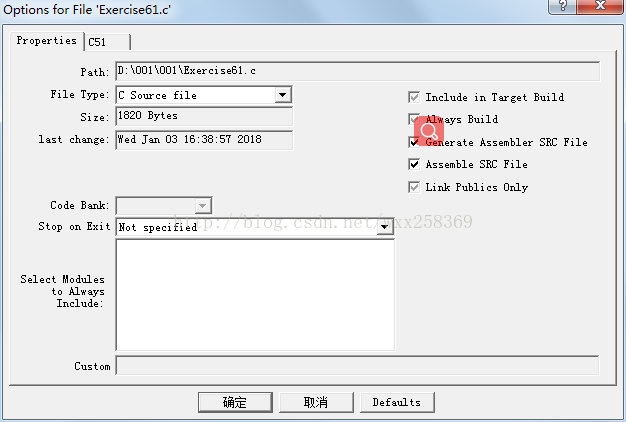

# Keil C51 C 编程

网页简例 [CSDN_LINK](https://blog.csdn.net/feihe0755/article/details/79663958)


## 一、基本架构

头文件问题 [Link]( https://wenku.baidu.com/view/c50debf9cc175527062208eb.html )


```c
#include <reg51.h>
int main(){
    return 0;
}
```


混合汇编
开启这个之后无法进入main函数，需要按照这个方法处理 [Link](http://www.360doc.com/content/14/0627/11/6828497_390221053.shtml)

把`keil`的`lib`文件夹里面的`c51s.lib`加入到工程中。


参考 [Link](https://blog.csdn.net/wxx258369/article/details/78962857)

  

```c
#pragma asm
#pragma endasm
```


中断

参考 [link](https://zhidao.baidu.com/question/170746894.html)

interrupt 后面的数字简单的说就是中断服务函数的代号
0代表外中断0
1代表定时计数器0中断
2代表外中断1
3代表定时计数器1中断
4代表串行口中断
所以interrupt 1代表定时计数器产生中断后就转到这个函数里面执行
using 后面的数字是个工作寄存器的代号，也就是R0—R7。如果不写的话由系统自动分配，一般不用去理会