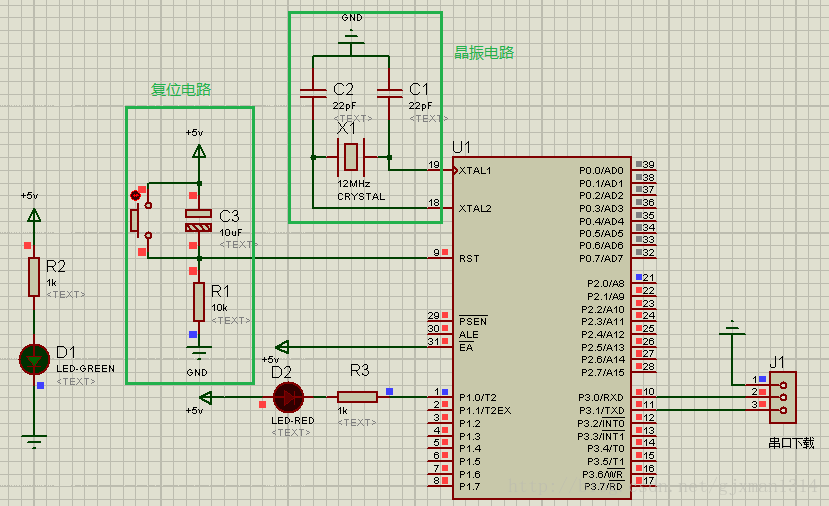
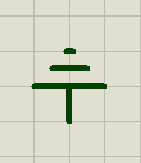
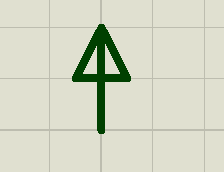

# 仿真

## 一、最小系统

 

​	单片机晶振提供的时钟频率越高，那么单片机运行速度就越快典型的晶振取11.0592MHz(方便串口波特率设置)或者12MHz(产生精确的uS级时歇,方便定时操作)，电容这里选择22pf（15~33pF都行，经验值），并且电容离晶振越近越好，晶振离单片机越近越好，的瓷片电容或者无极性的贴片电容，具体根据制作的电路板类型选择。

## 二、特殊元器件的特殊用途

### 1.排阻

**阻值设定** [Link](https://zhidao.baidu.com/question/1758196697456202468.html)

一般在排阻下面`RX8`和`RESPACK-8`这两个字段就是阻值。

## 附录 `元器件名字 & 位置`

### 1.Terminal

| 中文名称 | 软件中昵称 |                             图片                             |
| :------: | :--------: | :----------------------------------------------------------: |
|    地    |   GROUND   |  |
|   电源   |   POWER    |  |

### 2.一般器件

单片机编号  `at89c51`

电阻 `res`

电容 `cap` & `cap-elec`

晶振 `crystal`

38译码 `74hc138`

串转并 `74hc595`

### [参考]

1. [CSND Proteus器件参考]( https://blog.csdn.net/xpx1995/article/details/79031481 )
2. [Paincker Proteus器件中英文对照]( http://www.paincker.com/proteus-component )

