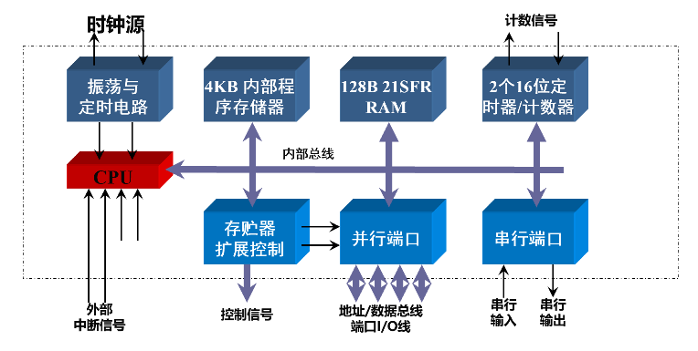
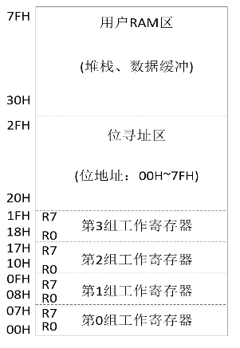
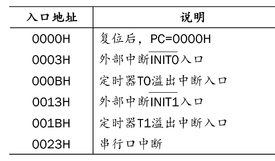
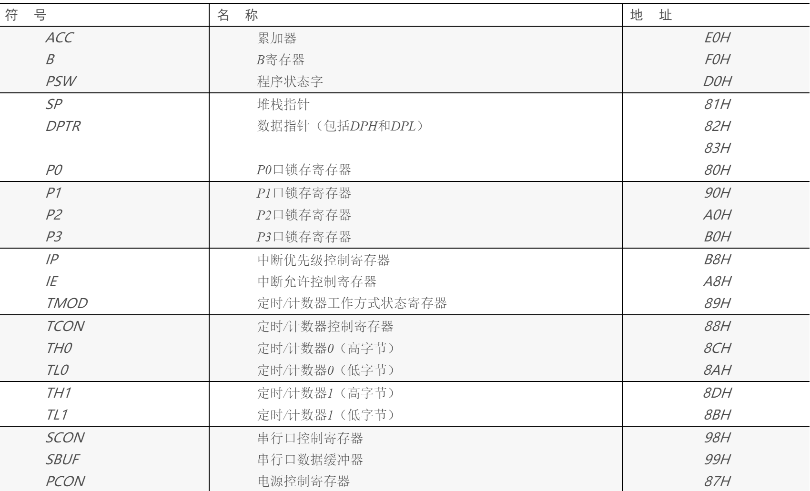
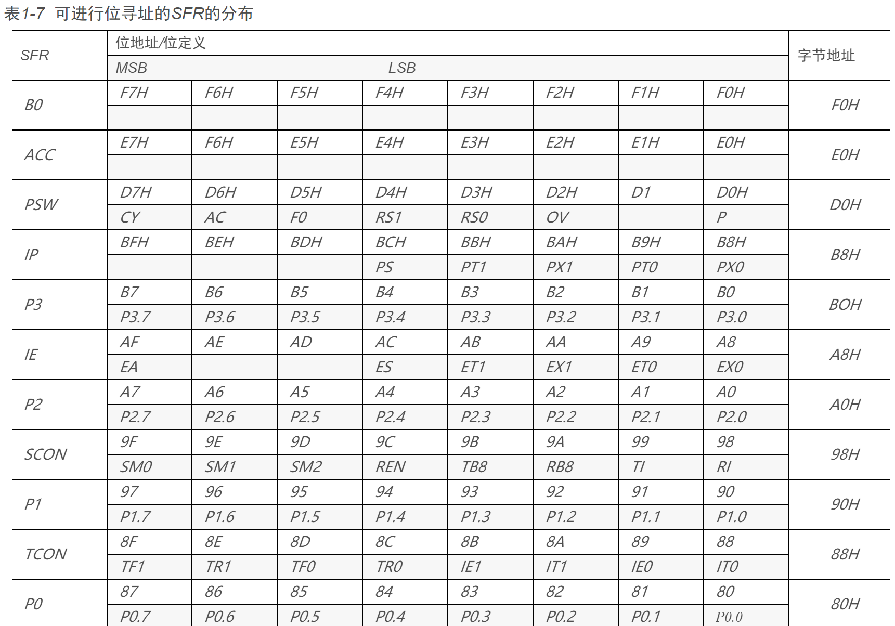

# 单片机

## 一、操作

内核选 `8051AH`

## 二、内部原理





## 三、命令

几个输出口可以单个位用，或者整体用

```assembly
MOV P1,#00h
CLR P1.0
SETB P1.0
MOV A,P3
MOV P3,A
```

微型机的存储单元的地址都是唯一的，不同的地址对应不同的存储单元，可以是ROM或RAM，而且用相同的指令访问ROM或RAM。


## 四、特殊地址




## 五、寄存器

参考 [Link CSDN](https://blog.csdn.net/shenhuxi_yu/article/details/54562705) 寄存器总结

### 初始化

参考 [Link](https://zhidao.baidu.com/question/434119583563741284?from=0&ssid=0&uid=bd_129113698248&pu=0%2Cos%40&fr=qb_topic&bd_page_type=1&step=77&init=middle )

​	单片机的复位操作使单片机进入初始化状态，其中包括使程序计数器PC＝0000H，这表明程序从0000H地址单元开始执行。单片机冷启动后，片内RAM为随机值，运行中的复位操作不改变片内RAM区中的内容，21个特殊功能寄存器复位后的状态为确定值。

### DPTR

<font color='red'>除了DPTR，寄存器都是`8 位`</font>

:warning: DPTR为16位地址寄存器，地址高8位存于DPH，地址低8位存于DPL

### 堆栈

```assembly
PUSH A ;错，如果是PUSH ACC就对了
PUSH B ;对
PUSH PSW ;对
PUSH R0 ;错
```

51单片机中，所有SFR寄存器可以用名称入栈，通用寄存器只能用直接寻址 


### SFR 特殊功能寄存器




